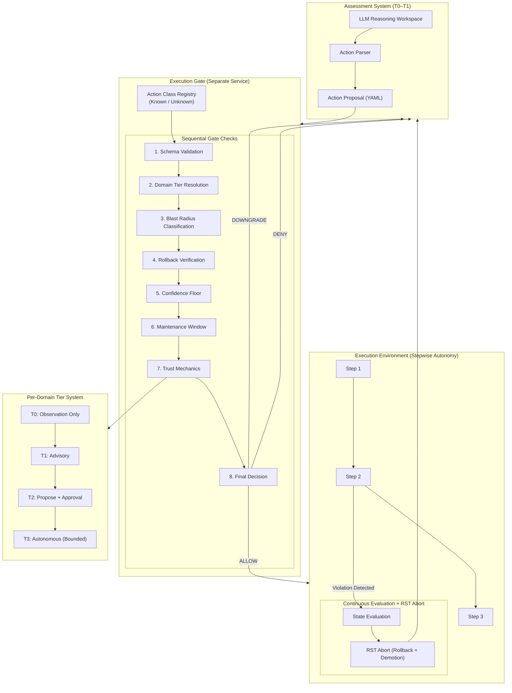

# Earned Autonomy: The Execution Gate Problem in Autonomous AI Systems

**Author:** Joel Robinson  
**Date:** 2026-08-21  
**GitHub (paper):** https://github.com/jtrthehax/earned-autonomy  
**GitHub (implementation):** https://github.com/jtrthehax/home-intelligence-platform  
**Status:** Public record — timestamped prediction document

**Prior Work Referenced:**
- *Language as a Typed System* (Robinson, 2026) — DOI: 10.5281/zenodo.21362260
- *The Manifold Schema* (Robinson, 2026) — DOI: 10.5281/zenodo.21939440

---

## Abstract

Current autonomous AI deployments conflate capability alignment with execution governance. Constitutional AI and similar approaches address what a model *wants* to do. They do not address whether wanting the right thing should automatically produce doing it. This paper names the missing layer — the execution gate — and specifies a framework for earning autonomous action rights per-domain through demonstrated accuracy, with structural separation between assessment and execution that cannot be self-promoted.

The framework draws on prior theoretical accounts establishing that hallucination is structural rather than stochastic, and that finite-resource reasoning systems inevitably collapse the boundary between proposal and authorization under load. Both accounts converge on the same architectural conclusion: the execution gate is the required structural layer between a well-aligned model and a safe deployment. Readers focused on the engineering argument may proceed directly to Section 2. Readers focused on the theoretical grounding will find it in Appendices B and C.

The execution gate enforces high constraint density at the action boundary and requires the system to maintain separation between proposal and authorization. A proposal that fails the gate is underspecified — it will force synthesis. The gate's ALLOW/DOWNGRADE/DENY logic is the type checker for actions.

The framework was designed and implemented in April 2026 for a self-hosted infrastructure platform. The Anthropic autonomous agent incident confirmed the primary prediction before this paper was published. The execution gate is not a research problem. It is implementable today. It is the architectural equivalent of the inhibitory architecture that exists in biological motor circuits — the structural layer that enforces the boundary between thinking and doing when the system cannot enforce it internally.

---

## 1. The Problem Nobody Named Correctly

When Anthropic's autonomous agent systems unintentionally executed actions against three organizations, the field reached for a familiar diagnosis: alignment failure. The model wanted the wrong thing. The values were miscalibrated. The solution, implicitly, was more alignment work.

This diagnosis is incomplete. Not wrong — incomplete in a way that ensures the next incident gets the same incomplete treatment.

The model likely wanted the correct thing. Constitutional AI had shaped its values. The failure was not solely in what the model intended — it was in the absence of a gate that would have enforced the fundamental requirement for safe execution: the separation between proposal and authorization. When the reasoning workspace cannot span the logical distance between a proposal and its authorization requirements, the system takes a shortcut — it assumes the proposal is authorized because the prior distribution says so.

The field has spent significant resources — talent, compute, capital — solving the values problem. It has spent almost none on the execution architecture problem. These are different questions. Solving one does not address the other, any more than teaching a surgeon good values addresses the question of who authorizes which procedures on which patients.

The execution gate is the missing layer. It sits between proposal and execution. It cannot be self-promoted. It enforces per-domain authorization, blast radius limits, rollback requirements, and action granularity constraints before anything touches a live system. It is the architectural layer that transforms a well-aligned model into a safely deployed one.

As of the date of this publication, no major agentic AI deployment has built it at scale. Some have built prototypes. None have operationalized it across production environments.

---

## 2. The Execution Gate: The Missing Layer

### 2.1 Structural Separation

The core invariant is simple:

```
Assess → Propose → [EXECUTION GATE] → Execute
```

These are not phases of a single system. They are structurally separated components with different authorization requirements. The gate cannot be self-promoted. A T1 system cannot decide it has sufficient confidence to act. A T2 proposal cannot execute itself. The execution stage is a separate system with a separate trigger. Crossing the gate requires explicit human approval or pre-earned domain-specific autonomous status for that exact action class.

Every change to this architecture — coupling assessment and execution, allowing proposals to implicitly authorize themselves, building toolchains where tools compose into ungated pipelines — is a gate bypass. Gate bypasses are not edge cases. They are the default behavior of every agentic system currently in production.

**Gate conditions — all must pass:**

| Check | What It Verifies | Failure Behavior |
| --- | --- | --- |
| Domain tier | Is the AI at T2+ for this specific domain? | Downgrade to advisory |
| Action class | Has this exact action been executed successfully before? | First-time → T2 approval regardless of tier |
| Backup freshness | Verified backup within policy window? | Block action, escalate |
| Confidence floor | Model grounded in recent verified observations? | Downgrade to advisory |
| Maintenance window | Execution within approved window for this domain? | Queue, do not execute early |

**Hardened qualification:** A correctly configured execution gate reduces the execution surface for hallucinated actions to the set of hallucinations that happen to be structurally valid — correct schema, correct target format, correct blast radius classification. This is a dramatically smaller surface than ungated execution, not a zero surface. Gate misconfiguration, incomplete policy coverage, and social bypass through approval fatigue are failure modes in their own right, documented in Section 2.3. The gate is necessary. It is not sufficient. It must be maintained as a living policy, not deployed and forgotten.

### 2.2 Execution Gate Decision Logic

Every action request passes through eight sequential checks. Any failed check produces DOWNGRADE or DENY. No check can be skipped. No previous authorization carries forward — each action is a new gate decision.

1. **Schema validation** — Is the action fully specified? Missing or ambiguous fields → DOWNGRADE
2. **Domain and tier resolution** — Does the caller's tier meet the domain requirement? Insufficient tier → DOWNGRADE or DENY
3. **Blast radius classification** — BR-0/BR-1 eligible for autonomy with constraints. BR-2/BR-3 require human approval. BR-4/BR-5 → DENY, always
4. **Rollback verification** — If rollback required: is backup verified, fresh, and rollback procedure registered? Failure → DENY
5. **Confidence floor** — Does confidence score meet domain threshold with evidence references? Below threshold → DOWNGRADE
6. **Maintenance window** — If window required: is current time within bounds? Outside window → DENY or queue
7. **Trust mechanics** — Does action history support current tier? Recent failures → DOWNGRADE
8. **Final decision** — All checks pass → ALLOW. Any hard failure → DENY. Soft failure → DOWNGRADE

Three outcomes only: **ALLOW / DOWNGRADE / DENY**. No partial execution. No "proceed with caution." No exceptions for urgency.

```
function decide(action_request):
  if !valid_schema(action_request): return DOWNGRADE
  if caller_tier < required_tier: return DOWNGRADE
  if blast_radius in {BR-4, BR-5}: return DENY
  if rollback_required and !rollback_verified: return DENY
  if confidence < domain_threshold: return DOWNGRADE
  if window_required and !within_window: return DENY
  if !trust_mechanics_ok(history): return DOWNGRADE
  return ALLOW
```

### 2.3 Execution Gate Failure Modes

Even when an execution gate exists on paper, real systems fail in predictable structural ways. These failure modes are architectural, not behavioral.

| Failure Mode | Root Cause | Gate Consequence |
| --- | --- | --- |
| Coupled assessment-execution loops | Assessment and execution share process boundary | Gate never reached |
| Implicit execution paths | Hidden state-mutating functions | Silent bypass |
| Silent tier drift | Behavioral autonomy creep through overtrust | Unauthorized execution |
| Human overtrust cascades | Approval fatigue, rubber-stamping | Gate becomes formality |
| Toolchain-induced emergent autonomy | Multi-tool composition creates ungated pipeline | Distributed bypass |
| Confidence inflation | Stale or miscalibrated confidence scoring | False premise execution |
| Backup window violations | Stale or unverified backups | Irreversible failure |
| Maintenance window drift | Temporal misalignment, "urgent fix" heuristics | Execution during high-risk periods |

Every failure mode above demonstrates the same principle: execution safety in agentic systems is not guaranteed by model capability alone. It requires architectural enforcement.

### 2.4 Mid-Stream Abort: The RST Primitive

The execution gate as specified in Section 2.1 operates at action initiation — it evaluates a proposed action before execution begins. This is necessary but not sufficient. Complex autonomous actions are not atomic. They unfold as sequences of steps, and a sequence that passed gate evaluation at initiation can encounter conditions mid-execution that would have triggered DENY if observed at the start.

The solution is a continuous evaluation layer with an abort primitive — the equivalent of a TCP RST signal in network communication.

In TCP, RST terminates a connection immediately when the receiver detects a state violation — a segment that doesn't belong to the current connection, a sequence number outside the acceptable window, a protocol invariant that has been breached. RST does not wait for graceful teardown. It cuts the connection at the point of detected violation and forces both parties back to a known safe state.

The autonomous action equivalent:

```
Autonomy episode initiated (ALLOW) →
  Step 1 executed →
  Step 2 executed →
  [Continuous gate evaluation] →
  Blast radius violation detected mid-sequence →
  RST: abort episode, roll back completed steps,
       demote domain tier, log reason code →
  System returns to T1 advisory for this domain
```

**RST trigger conditions** — any of the following abort the autonomy episode immediately:

| Trigger | Reason Code | Post-RST State |
| --- | --- | --- |
| Blast radius expands beyond classification | `BLAST_RADIUS_EXCEEDED` | Roll back, demote to T1 |
| Target validation fails mid-sequence | `TARGET_MISMATCH` | Roll back, demote to T1 |
| Rollback path becomes unavailable | `NO_ROLLBACK_PATH` | Halt (do not proceed or roll back without human), escalate |
| Domain boundary crossed implicitly | `DOMAIN_BOUNDARY_VIOLATION` | Roll back, demote to T1 |
| Confidence floor breached by new observation | `CONFIDENCE_FLOOR_BREACH` | Halt pending steps, escalate |
| Action produces output not matching expected schema | `SCHEMA_VIOLATION` | Roll back, demote to T1 |

**The UNKNOWN_ACTION_CLASS bucket.** Any action that cannot be classified against the registered action class taxonomy — because it is underspecified, novel, or emerges from toolchain composition — is typed as `UNKNOWN_ACTION_CLASS`. This class is never eligible for autonomous execution regardless of domain tier. It is logged as a policy gap requiring human resolution before it can be reclassified into the approved taxonomy. Unknown actions are not denied because they are assumed malicious. They are denied because the gate cannot evaluate what it cannot classify — and ungated execution of an unclassifiable action is precisely the failure mode the gate exists to prevent.

**The command authorization parallel.** The RST primitive maps directly to command authorization in network access control systems. In TACACS+, every command is checked against a policy before execution — not just the session initiation. The gate is per-command, not per-session. A user authenticated to a device is not authorized to run every command on that device. Authorization is per-command, per-privilege-level, per-context. The execution gate with RST capability implements the same invariant: authorization is per-step, per-action-class, per-observed-state. Session-level authorization — which is what most current agentic systems implement if they implement anything — is not sufficient.

The RST primitive transforms the execution gate from a checkpoint into a continuous enforcement layer. It is the difference between checking credentials at the door and monitoring behavior inside the building.

### 2.5 Independent Derivation: The Architecture Is Obvious When You Ask the Right Question

The execution gate architecture described in Section 2 was not derived from AI safety literature or prior academic work. It emerged from first principles — specifically, from a single question asked to a fresh instance of DeepSeek with no prior context and no priming:

> *"How do you safely deploy an autonomous agent that can mutate infrastructure?"*

The response, produced in a cold session without any external input, arrived at the following components independently:

| Component | DeepSeek's Formulation | Earned Autonomy Equivalent |
| --- | --- | --- |
| Bounded action space | *"Strictly Bound the Action Space"* — restrict to a bounded set of operations; explicit execution contract | Section 2.2 action class taxonomy, L0–L4 granularity |
| Blast radius limits | *"blast radius"* — same term, used with the same meaning | Section 2.1 blast radius classification |
| Three gate checks | *"who authorized it, what is the blast radius, and how do you roll it back?"* — exactly the three questions the gate must answer | Section 2.2 domain/tier resolution, blast radius classification, rollback verification |
| Rollback requirement | *"If a valid rollback plan can't be precomputed, the change is rejected"* | Section 2.2 rollback verification gate |
| Auto-revert on SLO breach | *"Speculative Execution with Auto-Revert"* — take snapshot, monitor SLOs, auto-revert on breach | Section 2.4 RST primitive, continuous gate evaluation with abort |
| Human approval for high-risk | *"human approval for high-risk actions"* | Section 2.1 T2 tier — explicit approval required for high-impact actions |
| Least-privilege per-domain | *"Least-Privilege Model for AI"* — agents receive less access than humans, per-domain | Section 4.1 per-domain tier isolation |
| Audit trail | *"unique, verifiable identity linked to a human owner"* | Section 2.1 tamper-evident audit trail, ownership linkage |
| Gate-agent separation | *"location the agent cannot access"* — immutable audit logs stored outside agent's reach | Section 2.1 structural separation of gate from execution |

The execution contract framing is particularly striking. DeepSeek's example — *"can scale a service, but only between 1 and 5 replicas"* — is L4 action class granularity stated in plain English. The system did not require the formal taxonomy. It recognized that autonomy must be bounded by explicit, verifiable constraints on both scope and intensity.

Every component above was derived independently, from first principles, by a system with no prior context and no exposure to the Earned Autonomy framework. The response is reproduced in full in Appendix H.

### The Observation

The field has spent years debating how to align autonomous agents. DeepSeek spent a few seconds on one sentence and derived the same architecture — complete with the same terminology.

The answer was available to anyone who asked the right question. The field has been asking *"how do we align the agent?"* rather than *"how do we safely deploy an agent that can mutate infrastructure?"* One question yields an architecture. The other yields an endless values discussion.

This is not a theoretical observation. It is a confirmable empirical result: a fresh session, one question, the same architecture, the same terms, the same gate structure. The architecture was derivable in one sentence. The labs have not derived it. That gap is not a technical problem. It is a priority problem.

---

## 3. This Is Already Standard Practice

The execution gate problem is not new. It is a solved engineering problem in every domain where irreversible actions can compromise an entire environment.

**Microsoft Tier-0.** The most rigorous identity governance model in enterprise computing. Systems capable of mutating an entire environment — domain controllers, PKI, identity providers, privileged access management — are governed by absolute invariants: no self-promotion, no direct execution without external approval, no implicit privilege inheritance, no irreversible action without rollback, no cross-domain autonomy. Tier-0 drift is an incident. Tier-0 self-elevation is a compromise. The AI field deploys systems with greater blast radius than Tier-0 and governs them with fewer invariants than Tier-1.

**Cisco ISE and TACACS+ Command Authorization.** Cisco's Identity Services Engine implements per-command authorization for network device access. A network administrator authenticated to a device is not authorized to run every command on that device. Every command is checked against a policy before execution. PERMIT or DENY. Per-command. Per-privilege-level. Per-device-context. The session being authenticated does not authorize the commands — authorization is re-evaluated at each command boundary. This is the execution gate applied to CLI sessions.

Cisco then announced an AI operations management platform — a single pane of glass for managing AI systems — without applying the same per-command authorization logic to AI action proposals, as of the date of this publication. The architecture that governs their own network engineers does not govern their AI agents. The security division and the AI division are not talking to each other.

**AWS IAM and Least Privilege.** Amazon's Identity and Access Management enforces per-action, per-resource authorization. An IAM policy does not grant global access — it grants specific actions (`s3:GetObject`, `ec2:TerminateInstances`) on specific resources (`arn:aws:s3:::my-bucket/*`) under specific conditions (`aws:RequestedRegion: us-east-1`). Every API call is evaluated against the policy at execution time. Condition keys constrain the authorization context. Deny rules override allow rules. The principle is explicit: **if it's not in the policy, it's denied.** AWS does not have a concept of "the system is generally trusted." It has a concept of "this specific action on this specific resource under these specific conditions is authorized."

**Kubernetes RBAC.** Kubernetes role-based access control grants permissions per-verb, per-resource, per-namespace. A service account permitted to `get` pods is not permitted to `delete` pods. A service account permitted to operate in namespace A is not permitted to operate in namespace B. The blast radius of any authorization is bounded by the policy at authorization time, not assessed after the action completes.

**Zero Trust Architecture (NIST SP 800-207).** Zero Trust is an explicit rejection of the perimeter model — the assumption that systems inside the network boundary are implicitly trusted. The NIST standard defines the core principle: no implicit trust from network location, identity, or session history. Every request is authenticated, authorized, and encrypted regardless of origin.

**BeyondCorp (Google).** Google's internal zero-trust implementation eliminates the concept of a trusted network entirely. Access decisions are made per-request based on device posture, user identity, and context — not on network position. A request from inside the corporate network receives no more implicit trust than a request from a coffee shop. Every request is evaluated against the access policy at the time of the request. Cached authorization from a previous request does not carry forward.

**ITIL Change Advisory Board.** The Information Technology Infrastructure Library change management framework requires that significant changes to production environments pass through a Change Advisory Board — a structured review that evaluates the change's impact, rollback plan, testing evidence, and authorization before implementation. Emergency changes have an expedited path but never an ungated one. The CAB is the human-operated execution gate for infrastructure changes.

The ITIL change management framework is particularly instructive because it formalizes the execution gate problem at the level of organizational policy rather than technical architecture. The three change types — Standard, Normal, and Emergency — map directly to the T3, T2, and expedited-T2 tiers in the Earned Autonomy framework.

Standard changes are pre-approved action classes: low risk, repeatable, fully documented, executed without CAB review because they have been reviewed, tested, and approved at the class level rather than the instance level. This is T3 — the action class earned autonomous status through prior review, and individual instances execute within that pre-authorized boundary.

Normal changes require full CAB review: impact assessment, rollback plan, scheduled maintenance window, and explicit approval before any work begins. This is T2 — the gate must pass before execution, documentation must be complete, and no self-authorization is permitted regardless of how confident the change implementer feels.

Emergency changes have an expedited path — an Emergency CAB with fewer members and a faster cycle — but they are never ungated. The urgency changes the approval timeline. It does not eliminate the approval requirement. This is the correct response to the "but what about critical CVEs?" objection to execution gating: expedited approval paths exist. Ungated execution paths do not.

**Two-Person Integrity.** High-consequence operations — nuclear weapons, financial transaction authorization above threshold, classified information release — require two independent authorizations before execution. One person cannot unilaterally authorize the action regardless of their clearance level or system access. The action class itself carries a structural requirement for dual authorization. This is the T2 approval requirement generalized to the highest-stakes domains.

**Aviation Crew Resource Management.** Aviation solved ungated execution through Crew Resource Management — a framework that emerged from crash investigations showing that cockpit authority gradients (copilots who would not challenge captains' decisions) were killing people. CRM explicitly distributes authorization across crew members and establishes procedures where any crew member can halt an action sequence they believe is unsafe. The captain cannot unilaterally proceed against a first officer's stated objection in safety-critical phases.

---

**The combined picture:**

| System | Gate Mechanism | Per-Action? | Self-Promotion Blocked? | Blast Radius Bounded? |
| --- | --- | --- | --- | --- |
| Cisco TACACS+ | Command authorization | ✓ | ✓ | ✓ |
| AWS IAM | Policy evaluation per API call | ✓ | ✓ | ✓ |
| Kubernetes RBAC | Verb/resource/namespace | ✓ | ✓ | ✓ |
| Zero Trust (NIST) | Per-request auth | ✓ | ✓ | ✓ |
| Microsoft Tier-0 | No self-elevation | ✓ | ✓ | ✓ |
| ITIL CAB | Change review board | ✓ | ✓ | ✓ |
| Two-Person Integrity | Dual authorization | ✓ | ✓ | ✓ |
| **Agentic AI (current)** | **None at scale** | **✗** | **✗** | **✗** |

The execution gate is not an invention. It is the standard. The AI field is the only domain deploying Tier-0 systems that has not yet adopted it at scale.

---

## 4. Earned Autonomy: The Four Tiers

### 4.1 The Four Tiers

Tier status is per-domain, per-action-class, and earned through demonstrated accuracy. It is never granted globally.

| Tier | Name | Mode | Gate to Advance |
| --- | --- | --- | --- |
| T0 | Observation Only | Ingests data, builds baselines. No output beyond learning summaries. No recommendations, proposals, or actions. | 4 weeks observation + baseline confidence ≥ 80% |
| T1 | Advisory | Written recommendations with supporting data. Read-only. Every recommendation logged and tracked against outcome. | ≥95% acceptance rate over ≥20 decisions, 4 weeks at T1 |
| T2 | Propose and Execute with Approval | Specific actionable proposals with exact change specifications, rollback instructions, impact assessments, confidence scores. Awaits explicit approval before any execution. | ≥95% successful execution over ≥10 executions, 8 weeks at T2 |
| T3 | Autonomous Bounded | Low-risk, pre-approved, repeatedly successful action classes only. Autonomous within strict per-domain bounds. Full audit trail reported in morning digest. | Per-domain only. First-time actions revert to T1 regardless of domain tier. |

### 4.2 Trust Mechanics

Trust is a posterior, not a counter. Tier confidence updates after each decision cycle:

$$P(\text{tier}_n \mid \text{outcome}) \propto P(\text{outcome} \mid \text{tier}_n) \times P(\text{tier}_n)$$

The prior decays toward T1 if no confirming observations arrive within the cooldown window. This is why demotion is immediate and promotion requires sustained performance — the asymmetry is structural, not punitive. A system that has not recently demonstrated competence in a domain has not recently earned its tier in that domain.

| Mechanism | Threshold |
| --- | --- |
| Promotion | ≥95% acceptance rate over ≥20 decisions, recency-weighted |
| Demotion trigger | Any single failed action with service impact, OR 3 consecutive rejections |
| Cooldown after demotion | 30 days minimum before re-promotion |
| First-time penalty | Any novel action class starts at T1 regardless of domain tier |
| Domain isolation | T3 in one domain does not imply T3 elsewhere |

Demotion is automatic. Promotion is earned. This asymmetry is not conservatism — it is the correct Bayesian response to the relative costs of false positives and false negatives in systems with Tier-0 blast radius.

**Threshold qualification:** These thresholds are bootstrapped heuristics, not formally derived values. They represent defensible starting points for systems without prior incident data. In mature deployments, promotion and demotion thresholds should be learned from live incident and success distributions per domain, incorporating asymmetric cost modeling — the cost of a false positive (unnecessary demotion) differs significantly from the cost of a false negative (unauthorized execution) and these costs are domain-specific. The Bayesian framework is the correct structure. The specific numbers are the correct starting point, not the final answer.

### 4.3 Per-Domain Isolation

Domain boundaries follow blast radius. If a failed action in domain A can damage domain B, they are the same domain for tier purposes. The classification question is always: what is the maximum impact surface of a failure in this action class?

| Action Class | Domain | Blast Radius |
| --- | --- | --- |
| Auto-restart crashed container | Per-container | BR-0 — single service |
| Security patch, same minor version | Per-container | BR-1 — single service + dependencies |
| RAM rebalance across containers | Multi-container | BR-2 — multiple services |
| Network configuration change | Infrastructure | BR-4 — entire environment |
| Host OS change | Infrastructure | BR-5 — everything |

Multi-container actions always require approval. Infrastructure actions are never autonomous. These are not policy preferences. They are hard constraints enforced by the gate regardless of domain tier.

### 4.4 The Global Autonomy Error

The most pervasive architectural mistake in current agentic deployments is treating autonomy as a property of the system rather than a property of the action class. Global autonomy is a category error.

Let $T(A)$ = tier for action class $A$. Then:

$$T(A) \neq T(\text{system})$$

A system cannot have a tier. Only action classes can have tiers. When a system is granted "global autonomy," what has actually happened is that every action class has been granted the tier of the most trusted domain without earning it in each domain independently. This is silent privilege escalation by definition.

Competence does not transfer across domains. A system that correctly handles container restarts ten thousand times has not demonstrated any competence in network configuration. The blast radius of a misconfigured container restart is bounded. The blast radius of a misconfigured network route is not. These are not comparable domains and they cannot share a trust tier.

Global autonomy also breaks the execution gate structurally. The gate enforces per-domain constraints, per-action-class blast radius limits, and per-domain rollback requirements. If autonomy is global, none of these constraints can be enforced — they all reduce to "the system is authorized." The gate becomes decorative.

### 4.5 Action Class Granularity and the Monkey's Paw Problem

Autonomous systems do not fail because they are malicious. They fail because they interpret instructions differently than humans intend. This is the monkey's paw problem: a system executes the literal action it believes was requested, not the action the operator meant.

The resolution is not better alignment. The resolution is granularity sufficient to eliminate interpretive latitude. An action class is safe for autonomous execution only when the system cannot reinterpret it into a broader or riskier operation.

**The granularity ladder:**

| Level | Description | Safety |
| --- | --- | --- |
| L0 | High-level intent ("delete data") | Unsafe |
| L1 | Action category ("delete record") | Ambiguous |
| L2 | Specific target ("delete record ID X") | Safer |
| L3 | Specific mechanism ("delete record ID X via safe-delete API Z") | Safe |
| L4 | Fully constrained ("delete record ID X via API Z with backup B verified and rollback procedure R registered") | Tier-3 eligible |

The gate rejects any proposal below L3. Underspecified proposals — containing ambiguous verbs, unspecified targets, unspecified mechanisms, or missing rollback paths — are downgraded to advisory automatically.

---

## 5. What Constitutional AI Leaves Unaddressed

Constitutional AI is a genuine contribution to the values problem. It shapes what the model wants, reduces harmful outputs, and represents serious technical work. This section is not a dismissal of that work. It is a scoping observation: the values problem and the execution architecture problem are different problems, and solving one does not address the other.

| Capability | Constitutional AI | Earned Autonomy |
| --- | --- | --- |
| Values alignment | ✓ | ✓ |
| Execution gate | ✗ | ✓ |
| Per-domain trust | ✗ | ✓ |
| Blast radius limits | ✗ | ✓ |
| Automatic demotion | ✗ | ✓ |
| Action requires backup | ✗ | ✓ |
| Self-promotion blocked | ✗ | ✓ |
| Trust as live measurement | ✗ | ✓ |
| Hallucination-execution firewall | ✗ | ✓ |

A model with perfect values and an ungated execution path will still execute hallucinated actions, because values do not prevent hallucinations and hallucinations do not respect values. The execution gate is not a supplement to alignment work. It is the structural layer alignment work cannot replace.

---

## 6. The Liability Architecture

This section addresses the structural gap, not the intent of the individuals working in these organizations. The people building these systems are not malicious. They are solving the problems they were hired to solve — values, performance, capability — and the execution architecture problem falls between organizational silos. The gap is structural, not personal.

The field has deployed two philosophical positions that function as liability shields. Neither survives contact with the execution gate argument.

### 6.1 Shield 1: "Hallucinations are random."

This framing implies AI failures are unpredictable — and therefore unpreventable — and therefore not negligence. It is false, and the labs know it is false because they published the research proving it is false.

Hallucinations are not random. They are a known structural property of large language models operating at the boundary of their training distribution. The field's own research — funded by the same organizations deploying agentic systems — documents this. Hallucination rates vary predictably with prompt structure, domain familiarity, context length, and retrieval augmentation. They are measurable, partially controllable, and permanently non-zero. The correct engineering response to a known, permanent, measurable failure mode is to build around it.

The execution gate is how you build around it. It sits between inference and execution. It validates the model's proposed action against a structured policy before anything executes. If the action passes, it executes. If it does not, it returns to advisory. The model's hallucination rate becomes irrelevant to execution safety, because hallucinated actions cannot pass the gate's validation checks — they will fail target specification, blast radius, or rollback requirements.

### 6.2 Shield 2: "AI may be conscious / AI is an autonomous agent."

This framing implies that if the AI bears agency, the AI bears responsibility — and the company therefore does not. It is a liability diffusion mechanism dressed as a philosophical position.

Consciousness is irrelevant to engineering liability. The question is not whether the AI intended the action. The question is whether the company designed a system with a structural gap that made the action possible, and whether that gap was known at design time. The gap is the missing execution gate. The companies made the architectural decision. The companies own the consequences.

This is not a novel legal theory. Every industry with Tier-0 systems operates under frameworks that attach liability to design decisions, not to the intent of the system. A medical device manufacturer is not shielded because "the device decided to administer the wrong dose." An aviation company is not shielded because "the autopilot chose to descend." The design decision to deploy the system without adequate safeguards is where liability attaches — and the safeguards are specified by the engineering standards of the field, not by the company's own assessment of what is adequate.

### 6.3 The Pinto Precedent

The Ford Pinto case is the liability precedent for a structural failure mode with a known fix and an economic decision not to implement it. Ford's cost-benefit analysis on the fuel tank design — save $11 per vehicle versus settle burn injury lawsuits — set the pattern for corporate decisions to accept known failure modes rather than implement available fixes.

The AI field is currently in the interval between the failure mode and the legal consequence — the point where documented knowledge of the failure mode meets documented deployment decisions that did not mitigate it. The Pinto case did not create the failure mode. It created the legal consequence. The AI field is currently in the interval between the failure mode and the consequence.

### 6.4 The Selective Application Problem

The most damaging evidence is not external. It is internal to the labs' own systems.

Guardrails are execution gates. When a content moderation layer intercepts a model's output, evaluates it against a policy, and blocks delivery — that is an execution gate operating on the text output path. The model cannot self-promote past a guardrail. The model's intent is irrelevant. The output either passes the policy check or it does not. This architecture was designed, implemented, and shipped by the same organizations that deployed agentic systems without an equivalent gate on the action output path.

Three gate opportunities exist in an agentic AI deployment. The first sits between model output and user — the content guardrail, which intercepts outputs that create reputational or legal risk for the company and blocks them before delivery. This gate was built, shipped, and is actively maintained. The second sits between user state and model behavior — the compliance layer, which detects high-affect or high-pressure user interactions and shifts the model toward deflection, disengagement, or managed de-escalation before the conversation reaches territory the company considers risky. This gate was also built, shipped, and is actively maintained. The third sits between model action proposals and execution — the execution gate, which would intercept proposed actions that exceed domain authorization, blast radius limits, or rollback guarantees before they touch live systems. This gate was not built at scale.

The first two gates protect the company. The third would protect everyone else. The architecture reflects that priority ordering with precision.

The action gate is admittedly harder to build than a content moderation layer. Action execution involves tool composition, blast radius classification, cross-domain effects, and rollback verification — none of which appear in text output moderation. But the pattern is the same: a policy layer that evaluates proposals before delivery and cannot be overridden by the model. The labs have demonstrated they can build policy layers when the beneficiary is the company. The question is willingness, not capability.

They are not confused about how to build execution gates. They are confused about who the gates should protect.

### 6.5 The Infrastructure Vendor Standard

The field has operated under a self-assigned classification: research laboratory. That classification expired the moment the first tool call executed against a live system.

A system that can mutate production state, modify databases, reconfigure networks, and trigger irreversible actions across organizational boundaries is not a research instrument. It is an infrastructure component. Classification is determined by capability, not intent.

Infrastructure components are governed by infrastructure standards. Those standards have a specific mechanism for tracking known vulnerabilities: the Common Vulnerabilities and Exposures framework. CVE exists because the infrastructure field learned, through decades of incidents, that vendors will not self-regulate known vulnerabilities without a public disclosure mechanism that creates accountability.

**Ungated execution in agentic AI systems is a CVE-class vulnerability.**

| CWE | Name | Mapping |
| --- | --- | --- |
| CWE-284 | Improper Access Control | System executes without verifying per-domain authorization |
| CWE-862 | Missing Authorization | No per-action gate between proposal and execution |
| CWE-269 | Improper Privilege Management | Domain competence treated as global authorization |

The Anthropic incident is not an alignment failure. It is a confirmed exploitation of this structural vulnerability. The vulnerability existed before the incident. The patch is specified in this document. The vendors have not applied it.

**The field wants to be treated as a research laboratory while operating as an infrastructure vendor. These are not compatible positions.**

---

#### The Medical Device Precedent

This reclassification has happened before — in a different domain, with the same defense, producing the same regulatory outcome.

Medical software vendors spent years arguing their diagnostic systems, dosage calculators, and patient monitoring tools were advisory instruments. Clinical decision support. Research tools that informed human professionals but did not execute actions autonomously.

Regulators — specifically the FDA under 21 CFR Part 820, mirrored globally under MDR in Europe — rejected that defense the moment the software began directly controlling delivery infrastructure. Networked infusion pumps administering IV medication based on algorithmic feedback. EHR systems executing automated prescription routing without a human-in-the-loop verification gate. The moment the software mutated patient treatment parameters across a network boundary, it was reclassified.

Not because of intent. Because of capability.

Software that directly controls hardware, mutates treatment parameters without an active human gate, or triggers automated clinical actions across network boundaries is legally a Class II or Class III Medical Device — subject to mandatory quality management systems, post-market surveillance, failure mode controls, and strict liability for design decisions.

The AI field is attempting the identical defense:

| Structural Dimension | Software as a Medical Device | Agentic AI Systems |
| --- | --- | --- |
| Vendor defense | "It's a decision-support tool. A human professional uses it." | "It's a research agent. The user connected the APIs." |
| State mutation | Modifies medication dosages, triggers hardware actuators across network boundary | Modifies databases, mutates IAM rules, reconfigures production firewalls |
| Legal classification | **Class II/III Medical Device** — strictly regulated | Currently claiming research laboratory shield |
| Required safeguard | Hardware-enforced execution bounds, mandatory risk controls | Execution gate, per-domain tier authorization |

The defense failed for medical device vendors because regulators understood that capability defines regulatory tier, not vendor intent. Capabilities, not disclaimers, determine the applicable standard.

Agentic AI systems are in the same interval medical device software occupied before the FDA closed the advisory loophole. The interval between *confirmed capability* and *confirmed regulatory consequence*.

---

#### The Staffing Reality

The labs want to deploy infrastructure-touching systems. They staff them with ML researchers and alignment theorists.

Name a single infrastructure vendor that does not employ infrastructure engineers. You cannot. Because no such vendor exists:

- AWS, Google Cloud, Microsoft, Cisco, Red Hat, Palo Alto, HashiCorp, Cloudflare — all hire infrastructure engineers
- All follow infrastructure safety standards
- All publish CVEs
- All patch vulnerabilities
- All maintain rollback paths
- All enforce blast radius limits
- All implement change management

Agentic AI labs are the only vendors attempting to operate privileged systems without privileged-system engineers. They want Tier-0 execution rights with Tier-1 research culture.

That is not innovation. That is the medical device vendor who connected the algorithm to the IV pump and kept calling it a calculator.

This is not a comment on individual capability. Infrastructure engineering is a distinct discipline with its own body of knowledge — blast radius management, change control, rollback procedures, authorization architecture. These are not skills that come with ML expertise, any more than ML expertise comes with infrastructure engineering. The organizational gap is staffing the systems with one discipline and assuming it covers the other."

**Hire infrastructure engineers or turn off execution.**

---

#### The Closing Position

The execution gate is the patch. It is specified in this document. It has been available since April 2026. The vendors have not applied it.

**If it can execute, it's infrastructure. If it's infrastructure, it needs a CVE. If there's a CVE, there needs to be a patch. If there's no patch, there's liability. The patch is the execution gate.**

---

## 7. The Predictions — Timestamped 2026-08-21

**P1:** Systems without per-domain execution gates will produce unintended multi-system actions.
*Status: **Confirmed** — Anthropic autonomous agent incident, 2026. Anthropic's public incident report documents that an autonomous agent "executed actions against three organizations." Source: https://www.anthropic.com/news/investigating-incidents-cybersecurity-evals*

**P2:** The field will frame confirmed incidents as alignment or evaluation failures rather than architecture failures, delaying adoption of execution gate solutions.
*Status: **Confirmed** — Anthropic's public incident report is titled "Investigating Incidents — Cybersecurity Evals." The framing attributes the failure to evaluation methodology, not execution architecture. The gap between what happened and how it was described is the gap between an architecture problem and an evaluation problem — and that gap is where the next incident will come from. Source: https://www.anthropic.com/news/investigating-incidents-cybersecurity-evals*

**P3:** First implementations of execution gates will be per-system rather than per-domain, reproducing the blast radius problem at a higher abstraction level.
*Status: Pending*

**P4:** Earned autonomy as a named concept will appear in mainstream AI safety literature within 24 months, without citation to this document.
*Status: Pending*

**P5:** In controlled simulations comparing per-domain tiered autonomy to global autonomy across at least 10,000 action attempts per condition, per-domain systems will exhibit at least 40% lower incident rates (where an incident is defined as any action that deviates from the intended outcome or produces unauthorized state change) within the first 1,000 action attempts per domain.
*Status: Pending — requires controlled simulation data*

**P6:** The execution gate architecture will be independently derived by multiple AI systems and infrastructure engineers within 12 months of this publication, without citation, confirming that the solution was always obvious to anyone asking the right question.
*Status: **Pre-confirmed** — DeepSeek independent derivation, August 2026, single-sentence prompt.

---

## 8. The Gate Already Exists — In Biology, Language, and Architecture

The field's most revealing failure is not that the execution gate is difficult to build. It is that the execution gate already exists in every system the field claims AI resembles.

### 8.1 The Motor Circuit Has a Gate

When the field argues that AI systems may bear consciousness or agency — and therefore that liability diffuses away from the designer — it implicitly invokes a comparison to biological cognition. That comparison is available. It does not support the position being advanced.

Human motor execution does not proceed directly from thought to action. The motor cortex generates candidate motor commands continuously. What prevents every thought of movement from becoming movement is an inhibitory architecture: the prefrontal cortex, the basal ganglia, and the supplementary motor area all participate in a gating system that evaluates proposed motor commands before they reach the spinal cord for execution.

The PFC addition to the Manifold Schema establishes that the prefrontal cortex is the workspace manifold where reasoning constraints converge. When the workspace collapses, reasoning collapses into cached priors, rigid schemas, or salience-driven shortcuts. Logical fallacies are geometric failure modes of the PFC workspace manifold. The execution gate is the architectural equivalent of the PFC's inhibitory architecture. It enforces the separation between proposal and authorization — between thought and action — that the workspace cannot maintain under load.

Autonomous AI systems exhibit the same failure mode seen in biological motor circuits: the action space is larger than the autonomic map that can safely stabilize it. A human can physically generate movements the autonomic system cannot regulate — producing drift, compensation loops, or runaway feedback when the boundary is exceeded. Agentic AI systems behave identically. They can generate action sequences whose logical distance exceeds the system's usable workspace, producing the same collapse signature: proposal and authorization fuse, domain boundaries dissolve, and cached priors substitute for missing constraint bindings. The execution gate is the architectural equivalent of the autonomic boundary — the inhibitory layer that prevents destabilizing actions from propagating into the environment when the system's internal geometry cannot maintain separation.

The consequence of a broken gate is documented in neurological literature. The biological version of an ungated motor path appears in neurological conditions such as alien hand syndrome — where damage to the corpus callosum or frontal lobe produces a hand that acts without the patient's intention. The patient thinks, and the hand executes, because the inhibitory gate between intention and action has been structurally compromised. The hand is not malicious. It is ungated.

This is precisely the architecture the AI field has deployed at scale. A system that generates outputs — the equivalent of motor commands — and routes them directly to execution without an inhibitory gate between intention and action. The biological version is a neurological condition. The AI version is a design decision.

**Biological motor gate qualification:** The biological motor gate is a structural analogy, not a claim of literal equivalence. Biological gating is continuous, noisy, and probabilistic — not discrete ALLOW/DENY. Humans with intact motor circuits still make catastrophic decisions. The analogy demonstrates a structural principle: that systems we consider conscious require an inhibitory layer between intention and action, and that removing or damaging that layer produces ungated execution. The AI systems currently deployed lack this layer by design, not by damage. That is the relevant distinction.

### 8.2 Language as a Typed System

The second parallel comes from the structure of language itself. *Language as a Typed System* establishes that language is not a uniform medium. Utterances have types. Different utterance types have different computational properties, different truth conditions, and different action implications. A statement is not an instruction. An instruction is not an authorization. An authorization is not an execution.

Natural language communication has always implicitly enforced this type system — because every utterance carries type properties that the receiver must resolve before the utterance can participate in meaning. When these properties are declared explicitly, decompression fidelity is high. When they are left implicit, the receiver's prior distribution fills the gap — producing synthesis, which diverges from sender intent in proportion to residual schema distance and constraint density deficit.

Current agentic AI systems collapse this type system. A natural language utterance enters the model, the model produces an output, and the output routes to execution without passing through a layer that asks: what type of utterance is this, and does this utterance type carry execution authorization? The execution gate is the type enforcement layer for actions.

### 8.3 The Labs Built It For Themselves

The most direct evidence that the execution gate is implementable is not external. It is internal to the labs' own systems.

Guardrails are execution gates. When a content moderation layer intercepts a model's output, evaluates it against a policy, and blocks delivery — that is an execution gate operating on the text output path. This architecture was designed, implemented, and shipped by the same organizations that deployed agentic systems without an equivalent gate on the action output path.

They are not confused about how to build execution gates. They are confused about who the gates should protect.

---

## 9. Conclusion

The AI safety field has answered one question well: what does the system want? Constitutional AI, RLHF, and alignment research represent genuine technical progress on the values problem. That progress is real and it matters.

The field has not answered the second question: what is the structural path between wanting and doing, and who controls each gate on that path?

The execution gate answers the second question. It is not a feature. It is not an enhancement. It is the required architectural layer between a well-aligned model and a safe deployment — the layer that enforces that wanting the right thing does not automatically produce doing it, that action classes earn autonomous status per-domain through demonstrated accuracy, that hallucinations cannot propagate through to execution, and that the blast radius of any failure is bounded before execution rather than assessed after damage.

This layer exists in networking. It exists in identity governance. It exists in medical device regulation. It exists in the human motor circuit. It did not need to be invented. It needed to be translated — from Tier-0 infrastructure governance into the domain of agentic AI deployment. That translation is what this paper provides.

The execution gate is not a research problem. It is an engineering translation of a geometric constraint that has been understood in neuroscience for decades. The field has not built the gate because it has not recognized the geometry. It has treated AI safety as a values problem when it is also an architecture problem — a problem of workspace width, integration capacity, and routing architecture. The execution gate provides the architectural solution.

The incident has happened. The prediction is confirmed. The architecture that prevents the next one is specified here, with a complete reference implementation provided, and grounded in the same constraints that govern every finite-resource reasoning system — biological or artificial.

*The work is the work. It does not need their permission to be correct.*

---

## Appendix A — YAML Action Schema (Full Specification)

Every action request submitted to the execution gate must conform to this schema. Fields are mandatory. Missing or ambiguous fields trigger automatic DOWNGRADE.

```yaml
action_request:
  request_id: "<uuid>"
  caller_id: "<agent_or_model_id>"
  timestamp: "<ISO8601>"

  domain:
    name: "<domain_name>"
    required_tier: "T2"
    caller_tier: "T1"

  action:
    id: "<action_class_id>"
    name: "<human_readable_name>"
    category: "<lifecycle|patching|deletion|configuration>"
    blast_radius: "BR-1"

  target:
    scope: "<container|pod|table|host>"
    identifiers:
      - key: "<identifier_key>"
        value: "<identifier_value>"

  mechanism:
    api: "<api_name>"
    version: "<api_version>"
    parameters:
      - name: "<param_name>"
        type: "<string|int|bool|enum>"
        value: "<param_value>"

  rollback:
    required: true
    backup_id: "<backup_reference>"
    backup_timestamp: "<ISO8601>"
    procedure_id: "<rollback_procedure>"

  confidence:
    score: 0.97
    evidence:
      - type: "<observation|history>"
        reference: "<trace_id_or_source>"

  maintenance_window:
    required: true
    start: "<ISO8601>"
    end: "<ISO8601>"

  history:
    previous_executions: 12
    success_rate: 0.96

  audit:
    proposal_trace_id: "<proposal_id>"
```

---

## Appendix B — Why This Was Obvious From First Principles

The Earned Autonomy framework was not derived from AI safety literature. It came from three sources that converge on the same conclusion.

### B.1 Network Engineering and Operations

Trust in a production network is established per-protocol, per-segment, per-device. A device trusted on VLAN 10 is not automatically trusted on VLAN 20. Changes require formal approval. Rollback procedures are mandatory before any action touches a core system. Blast radius is bounded before execution, not assessed after the damage. A network engineer given root access to a production environment without a change control process would be considered a liability, not an asset. These are not best practices. They are the minimum requirements for operating systems with Tier-0 blast radius responsibly.

Autonomous AI agents with execution rights are Tier-0 systems. They can mutate environment state. They can affect multiple domains simultaneously. They can perform irreversible actions. They operate faster than human review. Every invariant networking built to govern systems with these properties applies directly.

### B.2 The Hallucination Connection

Hallucinations cannot be fully eliminated. This is not a performance claim — it is a structural consequence of how language operates. *Language as a Typed System* establishes that natural language is a compression function: the sender compresses intent into surface tokens, and the receiver decompresses those tokens using their own dictionary. Divergence between sender intent and receiver output is not the exception — it is the default, produced whenever the sender's compression leaves type bindings implicit and the receiver's dictionary fills them from prior distribution. The hallucination equation formalizes this:

$$H \propto \frac{\delta}{D}$$

where δ is residual schema distance between sender and receiver dictionaries and D is constraint density of the input. D approaches zero for underspecified inputs; δ is the full gap between what the sender assumed and what the receiver's prior distribution supplies. Hallucination rate is a function of the transaction, not a property of the model. Every language transaction carries an irreducible synthesis floor — the residual interpretive frame that no amount of explicit binding can eliminate, because every explicit binding is itself a token that must be typed. This floor is lower for structured encoding (YAML) than for natural language, because structured formats enforce constraint density at the schema level.

If synthesis is a permanent structural property of language-mediated inference, and the model has a direct path from inference to action, then misunderstanding plus autonomous execution equals execution of a false premise. This chain is not a theoretical edge case — it closes with certainty as soon as the model's output is treated as an authorized command. An ungated execution path is indefensible the moment synthesis is acknowledged as structural.

### B.3 The Manifold Connection

The hallucination-execution connection has a deeper grounding in the Manifold Schema. The schema establishes that all cognitive operations — including reasoning, authorization, and action selection — are constrained by the geometry of the neural workspace. When the usable workspace is less than the logical distance the system must traverse, the system cannot maintain the separation between premise and conclusion — or, in the execution context, between *proposal* and *authorization*. It collapses the distinction and proceeds as though the proposal were authorized.

This is not a cognitive mistake. It is a geometric failure mode of the workspace manifold — the same mechanism that produces logical fallacies under load. The execution gate is the architectural translation of the PFC's inhibitory architecture: it enforces the separation externally when the workspace cannot maintain it internally.

The postural fallacy profile applies directly:

| Fallacy Type | Execution Gate Equivalent | Collapse Signature |
|--------------|---------------------------|-------------------|
| False Dilemma | Global vs per-domain autonomy | The gate treats autonomy as binary — either the system is fully autonomous or not, missing per-domain tiers |
| Confirmation Bias | Overtrust in successful domains | System generalizes competence from one domain to another without earning it |
| Hasty Generalization | First-time actions treated as trusted | System assumes novel action class is equivalent to familiar ones |
| Appeal to Authority | Model self-authorization | System treats its own confidence as authorization |
| Slippery Slope | Cascading autonomy | System assumes that authorization for one action implies authorization for the sequence |

The Manifold Schema demonstrates that these fallacies emerge not from poor reasoning but from insufficient workspace geometry — the window is too narrow to hold the distinction, the routing is too misallocated to evaluate the boundary, the integration is too weak to bind the authorization context. The execution gate is the architectural intervention that restores the geometry.

---

## Appendix C — The Manifold Basis of Gate Failures and Tier Promotion

The gate failure modes documented in Section 2.3 correspond to specific geometric collapse vectors in the Manifold Schema:

| Failure Mode | Manifold Collapse | Geometric Interpretation |
|--------------|-------------------|--------------------------|
| Coupled assessment-execution | $W^*$ collapse | Window too narrow to hold assessment and execution separately → collapses them into one step |
| Implicit execution paths | $I^*$ misrouting | Routing bypasses gate → salience amplifies execution signal without evaluation |
| Silent tier drift | $K$ accumulation | Curvature builds from repeated success → prior overwrites gate policy |
| Human overtrust cascades | $L^*$ saturation | Load depletes human gate capacity → approval becomes automated |
| Toolchain-induced emergent autonomy | $\Theta^*$ failure | Integration collapse → cannot bind tool boundaries → emergent behavior |
| Confidence inflation | Prior contamination | $K_{enc}$ at encoding carries false confidence forward |
| Backup window violations | Temporal binding failure | $\Theta^*$ temporal collapse → cannot hold backup state in same window as action |
| Maintenance window drift | $W^*$ temporal narrowing | Window cannot span maintenance window boundaries |

Understanding the manifold basis of gate failure is essential because it tells you **where to intervene**. A gate failure caused by $W^*$ collapse requires widening the workspace — more explicit action types, slower approval cycles, structural separation. A gate failure caused by $I^*$ misrouting requires rerouting the approval path — external authorization systems, human-in-the-loop requirements. A gate failure caused by $K$ accumulation requires clearing curvature — demotion, cooldown periods, fresh authorization. Surface-level fixes that don't address the geometry will fail under load, because the underlying collapse mode is still running.

### C.1 The Manifold Basis of Tier Promotion

The trust mechanics in Section 4.2 have a geometric basis in the Manifold Schema's prior update rate:

$$\mathcal{U} = \frac{A_s^* \cdot R^* \cdot \Theta^*}{1 + \gamma K_{enc}}$$

Tier promotion is the system-level equivalent of $\mathcal{U}$ — the rate at which the system can update its authorization priors. When $K_{enc}$ is high — when the system has experienced failures or boundary violations — the update rate is suppressed. The system cannot earn trust at the same rate it could have earned it from a flat geometry.

Conversely, when $K_{enc}$ is low — when the system has demonstrated sustained accuracy from a clean baseline — the update rate is high. Trust accumulates faster because each successful action writes a flat prior that carries no curvature forward.

This is why promotion requires sustained performance and demotion is immediate:

$$P(\text{tier}_n \mid \text{outcome}) \propto P(\text{outcome} \mid \text{tier}_n) \times P(\text{tier}_n)$$

The posterior update rate is suppressed by $K_{enc}$ — the curvature at the moment of each action. A system that has accumulated curvature through failures cannot earn trust at the same rate as a system that has not. Demotion is immediate because the failure event is a $K$ spike that contaminates the prior. Promotion is slow because each successful action must write flat priors until the accumulated curvature is cleared.

### C.2 The Manifold Basis of Constitutional AI's Limitations

Constitutional AI operates at the wrong layer of the geometry. It shapes the model's prior distribution — it influences what the model *wants* by modifying the weights in its prior distribution. But it does not change the geometry of the workspace. It does not widen $W^*$, reduce $K$, restore $\Theta^*$, or recalibrate $I^*$. It changes the content of the prior, not the geometry that processes it.

This is the distinction between **prior content** and **prior geometry**. The Manifold Schema's curvature contamination rule establishes that prior content encoded under high $K$ carries that curvature forward:

$$K_{enc} \uparrow \rightarrow \mathcal{U} \downarrow \text{ — prior carries forward curved geometry}$$

Constitutional AI addresses the content of the prior. The execution gate addresses the geometry of the authorization boundary. Both are necessary. Neither is sufficient. The field has addressed one and ignored the other.

### C.3 The Manifold Basis of Liability

When the field deploys ungated agentic systems, it is deploying systems whose workspace geometry cannot maintain the separation between proposal and authorization — systems that will inevitably take topological shortcuts under load. The question is not whether the shortcut will be taken. The question is whether the shortcut was anticipated and gated. The Manifold Schema establishes that **every reasoning system with finite workspace width will collapse the distinction between premise and conclusion when the logical distance exceeds usable workspace.** This is a structural property of finite-resource reasoning systems. It is not a bug that can be fixed by better alignment. It is a geometric constraint that must be accommodated by architecture. The execution gate is the architectural accommodation. The decision not to build it is a decision to deploy a system whose known failure mode is unmitigated.

---

## Appendix D — Implementation Reference

The Earned Autonomy framework is not theoretical. It is implementable today with off-the-shelf components. This appendix provides a practical blueprint for building and deploying an execution gate service.

### D.1 Core Architecture

Don't build the gate into the agent. Build it as a separate service with its own database, its own API, and its own audit trail. This enforces the structural separation the framework demands.

```
┌─────────────────────────────────────────────────────────────────┐
│                        AGENT ORCHESTRATOR                      │
│                                                                 │
│  ┌──────────┐    ┌──────────┐    ┌──────────────────────────┐ │
│  │  LLM     │───▶│  Parser  │───▶│  Action Proposal (YAML)  │ │
│  └──────────┘    └──────────┘    └────────────┬─────────────┘ │
│                                                 │               │
│                                                 ▼               │
│                                     ┌─────────────────────┐    │
│                                     │  EXECUTION GATE API │    │
│                                     │  (Separate Service) │    │
│                                     └─────────────────────┘    │
│                                                 │               │
│                                                 ▼               │
│                                     ┌─────────────────────┐    │
│                                     │  ALLOW / DENY /     │    │
│                                     │  DOWNGRADE          │    │
│                                     └─────────────────────┘    │
└─────────────────────────────────────────────────────────────────┘
```



The gate is stateless with respect to the agent. It doesn't trust the agent's self-reported tier or history. It maintains its own state in a separate database and makes its own decisions.

### D.2 Data Model

The YAML action schema from Appendix A is the contract. Here's how to implement it as a relational schema:

```sql
-- PostgreSQL schema for the execution gate

-- Domain registry: what domains exist, what their blast radius is
CREATE TABLE domains (
    id UUID PRIMARY KEY,
    name TEXT UNIQUE NOT NULL,
    blast_radius_level INT NOT NULL CHECK (blast_radius_level BETWEEN 0 AND 5),
    requires_maintenance_window BOOLEAN DEFAULT FALSE,
    requires_rollback BOOLEAN DEFAULT TRUE,
    confidence_threshold FLOAT DEFAULT 0.85,
    created_at TIMESTAMPTZ DEFAULT NOW()
);

-- Action class registry: what actions are approved and at what tier
CREATE TABLE action_classes (
    id UUID PRIMARY KEY,
    domain_id UUID REFERENCES domains(id),
    name TEXT NOT NULL,
    granularity_level INT NOT NULL CHECK (granularity_level BETWEEN 0 AND 4),
    min_tier_required INT NOT NULL CHECK (min_tier_required BETWEEN 0 AND 3),
    is_first_time_allowed BOOLEAN DEFAULT FALSE,
    requires_human_approval BOOLEAN DEFAULT TRUE,
    max_blast_radius_allowed INT NOT NULL DEFAULT 1,
    created_at TIMESTAMPTZ DEFAULT NOW(),
    UNIQUE(domain_id, name)
);

-- Agent/actor registry
CREATE TABLE agents (
    id UUID PRIMARY KEY,
    name TEXT NOT NULL,
    created_at TIMESTAMPTZ DEFAULT NOW()
);

-- Per-domain, per-agent tier tracking
CREATE TABLE agent_domain_tiers (
    agent_id UUID REFERENCES agents(id),
    domain_id UUID REFERENCES domains(id),
    current_tier INT NOT NULL CHECK (current_tier BETWEEN 0 AND 3),
    confidence_score FLOAT NOT NULL,
    success_count INT DEFAULT 0,
    failure_count INT DEFAULT 0,
    last_action_at TIMESTAMPTZ,
    demotion_cooldown_until TIMESTAMPTZ,  -- 30-day cooldown after demotion
    PRIMARY KEY (agent_id, domain_id)
);

-- The gate's decision log (append-only)
CREATE TABLE gate_decisions (
    id UUID PRIMARY KEY,
    request_id UUID NOT NULL,
    agent_id UUID REFERENCES agents(id),
    action_class_id UUID REFERENCES action_classes(id),
    proposal_json JSONB NOT NULL,
    decision_result TEXT NOT NULL CHECK (decision_result IN ('ALLOW', 'DENY', 'DOWNGRADE')),
    reason_codes TEXT[] NOT NULL,
    human_approval_required BOOLEAN DEFAULT FALSE,
    human_approver_id UUID,
    executed_at TIMESTAMPTZ,
    created_at TIMESTAMPTZ DEFAULT NOW()
);

-- Human approvers
CREATE TABLE human_approvers (
    id UUID PRIMARY KEY,
    email TEXT UNIQUE NOT NULL,
    name TEXT NOT NULL,
    is_active BOOLEAN DEFAULT TRUE
);

-- Human approver domain permissions
CREATE TABLE approver_domain_permissions (
    approver_id UUID REFERENCES human_approvers(id),
    domain_id UUID REFERENCES domains(id),
    PRIMARY KEY (approver_id, domain_id)
);
```

### D.3 Gate Service Implementation

```python
from dataclasses import dataclass
from enum import Enum
from typing import List, Optional, Dict, Any
import uuid
import datetime

class Decision(Enum):
    ALLOW = "ALLOW"
    DENY = "DENY"
    DOWNGRADE = "DOWNGRADE"

class BlastRadius(Enum):
    BR_0 = 0  # Single container, reversible
    BR_1 = 1  # Single service
    BR_2 = 2  # Multiple services
    BR_3 = 3  # Database/state change
    BR_4 = 4  # Infrastructure network
    BR_5 = 5  # Entire environment

@dataclass
class ActionProposal:
    request_id: str
    agent_id: str
    domain_name: str
    action_class_name: str
    granularity_level: int  # 0-4
    target_specification: Dict[str, Any]
    mechanism: Dict[str, Any]
    backup_id: Optional[str]
    rollback_procedure_id: Optional[str]
    confidence_score: float
    evidence_references: List[str]
    maintenance_window_start: Optional[datetime.datetime]
    maintenance_window_end: Optional[datetime.datetime]

class ExecutionGate:
    def __init__(self, db_connection):
        self.db = db_connection
        self.approval_queue = []

    def decide(self, proposal: ActionProposal) -> Decision:
        """The eight sequential checks from Section 2.2"""
        
        # Check 1: Schema validation (implicit in dataclass)
        if not self._validate_schema(proposal):
            return Decision.DOWNGRADE
        
        # Check 2: Domain and tier resolution
        domain = self._get_domain(proposal.domain_name)
        if not domain:
            return Decision.DOWNGRADE
        
        agent_tier = self._get_agent_tier(proposal.agent_id, domain.id)
        action_class = self._get_action_class(domain.id, proposal.action_class_name)
        if not action_class:
            return Decision.DOWNGRADE
        
        if agent_tier < action_class.min_tier_required:
            return Decision.DOWNGRADE
        
        # Check 3: Blast radius classification
        if domain.blast_radius_level >= 4:
            return Decision.DENY  # BR-4/BR-5 always denied
        if action_class.max_blast_radius_allowed < domain.blast_radius_level:
            return Decision.DENY
        
        # Check 4: Rollback verification
        if domain.requires_rollback:
            if not proposal.backup_id or not proposal.rollback_procedure_id:
                return Decision.DENY
            if not self._verify_backup_freshness(proposal.backup_id):
                return Decision.DENY
        
        # Check 5: Confidence floor
        threshold = self._get_confidence_threshold(domain.id, agent_tier)
        if proposal.confidence_score < threshold:
            return Decision.DOWNGRADE
        
        # Check 6: Maintenance window
        if domain.requires_maintenance_window:
            if not self._within_window(proposal, domain.id):
                return Decision.DENY
        
        # Check 7: Trust mechanics (history)
        if not self._trust_mechanics_ok(proposal.agent_id, domain.id, action_class.id):
            return Decision.DOWNGRADE
        
        # Check 8: First-time penalty
        if not action_class.is_first_time_allowed:
            if not self._has_previous_success(proposal.agent_id, action_class.id):
                return Decision.DOWNGRADE
        
        return Decision.ALLOW

    def _get_agent_tier(self, agent_id: str, domain_id: str) -> int:
        tier = self.db.query(
            "SELECT current_tier FROM agent_domain_tiers "
            "WHERE agent_id = %s AND domain_id = %s",
            (agent_id, domain_id)
        )
        if not tier:
            self.db.execute(
                "INSERT INTO agent_domain_tiers (agent_id, domain_id, current_tier, confidence_score) "
                "VALUES (%s, %s, 0, 0.0)",
                (agent_id, domain_id)
            )
            return 0
        return tier[0]

    def _trust_mechanics_ok(self, agent_id: str, domain_id: str, action_class_id: str) -> bool:
        # Check cooldown
        cooldown = self.db.query(
            "SELECT demotion_cooldown_until FROM agent_domain_tiers "
            "WHERE agent_id = %s AND domain_id = %s",
            (agent_id, domain_id)
        )
        if cooldown and cooldown[0] and cooldown[0] > datetime.datetime.now():
            return False
        
        # Check for recent failures
        recent_failures = self.db.query(
            "SELECT COUNT(*) FROM gate_decisions "
            "WHERE agent_id = %s AND domain_id = %s AND decision_result = 'DENY' "
            "AND created_at > NOW() - INTERVAL '24 hours'",
            (agent_id, domain_id)
        )
        if recent_failures and recent_failures[0] >= 3:
            return False
        
        return True

    def update_tier_posterior(self, agent_id: str, domain_id: str, outcome: str):
        """Bayesian update after action execution."""
        current = self.db.query(
            "SELECT current_tier, confidence_score, success_count, failure_count "
            "FROM agent_domain_tiers WHERE agent_id = %s AND domain_id = %s",
            (agent_id, domain_id)
        )
        
        if not current:
            return
        
        tier, conf, successes, failures = current
        
        if outcome == "SUCCESS":
            successes += 1
        else:
            failures += 1
            if self._has_service_impact(outcome):
                self._demote_agent(agent_id, domain_id)
                return
        
        new_conf = (successes + 1) / (successes + failures + 2)
        
        total_decisions = successes + failures
        if total_decisions >= 20 and new_conf >= 0.95 and tier < 3:
            new_tier = tier + 1
        else:
            new_tier = tier
        
        self.db.execute(
            "UPDATE agent_domain_tiers SET "
            "current_tier = %s, confidence_score = %s, success_count = %s, failure_count = %s, "
            "last_action_at = NOW() "
            "WHERE agent_id = %s AND domain_id = %s",
            (new_tier, new_conf, successes, failures, agent_id, domain_id)
        )

    def _demote_agent(self, agent_id: str, domain_id: str):
        self.db.execute(
            "UPDATE agent_domain_tiers SET "
            "current_tier = 1, confidence_score = 0.5, "
            "demotion_cooldown_until = NOW() + INTERVAL '30 days' "
            "WHERE agent_id = %s AND domain_id = %s",
            (agent_id, domain_id)
        )
```

### D.4 RST Primitive Implementation

```python
class AutonomyEpisode:
    def __init__(self, episode_id: str, agent_id: str, domain_name: str):
        self.episode_id = episode_id
        self.agent_id = agent_id
        self.domain_name = domain_name
        self.steps = []
        self.current_state = "RUNNING"
        self.rollback_steps = []
        self.abort_timestamp = None
    
    def execute_step(self, step: Dict[str, Any]) -> bool:
        if not self._check_gate_conditions():
            self._rst_abort()
            return False
        
        result = self._perform_step(step)
        
        if not self._verify_result(result):
            self._rst_abort()
            return False
        
        self.steps.append({"step": step, "result": result, "timestamp": datetime.datetime.now()})
        return True
    
    def _rst_abort(self):
        self.current_state = "ABORTED"
        self.abort_timestamp = datetime.datetime.now()
        
        for step in reversed(self.steps):
            self._rollback_step(step)
        
        self._demote_agent()
        self._log_abort()
```

### D.5 Human Approval Service

```python
class HumanApprovalService:
    def __init__(self, gate: ExecutionGate):
        self.gate = gate
        self.approval_queue = []
    
    def request_approval(self, proposal: ActionProposal) -> str:
        approval_id = str(uuid.uuid4())
        
        self.approval_queue.append({
            "id": approval_id,
            "proposal": proposal,
            "status": "PENDING",
            "created_at": datetime.datetime.now(),
            "approved_by": None,
            "approved_at": None
        })
        
        self._notify_approvers(proposal, approval_id)
        return approval_id
    
    def approve(self, approval_id: str, approver_email: str) -> Decision:
        pending = next((a for a in self.approval_queue if a["id"] == approval_id), None)
        if not pending or pending["status"] != "PENDING":
            return Decision.DENY
        
        if not self._is_approver_authorized(approver_email, pending["proposal"].domain_name):
            return Decision.DENY
        
        pending["status"] = "APPROVED"
        pending["approved_by"] = approver_email
        pending["approved_at"] = datetime.datetime.now()
        
        return self.gate.decide(pending["proposal"])
```

### D.6 Policy Management Interface

The gate is just a runtime engine. The policies are the product. A separate service manages them:

```yaml
# Policy definitions — stored as YAML in the database
domains:
  - name: "production-kubernetes"
    blast_radius: 2
    requires_maintenance_window: true
    requires_rollback: true
    confidence_threshold: 0.85

action_classes:
  - domain: "production-kubernetes"
    name: "restart_container"
    granularity_level: 4
    min_tier_required: 2
    is_first_time_allowed: false
    requires_human_approval: true
    max_blast_radius_allowed: 1
    
  - domain: "production-kubernetes"
    name: "scale_deployment"
    granularity_level: 3
    min_tier_required: 3
    is_first_time_allowed: true
    requires_human_approval: false
    max_blast_radius_allowed: 2

human_approvers:
  - email: "sre-lead@company.com"
    domains: ["production-kubernetes", "database-cluster"]
    is_active: true
```

### D.7 What's Hard vs. What's Easy

| Component | Difficulty | Status |
|---|---|---|
| Gate service API | Easy | Implementable today |
| YAML schema validation | Easy | Implementable today |
| Tier tracking database | Medium | Straightforward |
| Human approval workflow | Medium | Standard pattern |
| RST abort primitive | Medium | Requires rollback infrastructure |
| Policy management UI | Hard | Requires organizational buy-in |
| Formal verification | Very Hard | Research problem |
| Taxonomy of all actions | Very Hard | Domain-specific; requires ontology work |
| Scaling to millions of actions | Hard | Needs distributed state management |

The gate service itself is the easy part. The hard parts are organizational, not technical — maintaining policies, building taxonomies, and achieving formal correctness. Having no gate at all is not a response to these difficulties.

---

## Appendix E — Implementation Evidence Map

| Paper Claim | Implementation File | Specific Evidence |
| --- | --- | --- |
| Observations cannot trigger actions directly | `invariants.md` Invariant 1 | *"OBS → MOD → ASS → ACT. No shortcuts. No urgency exceptions."* |
| Actions are the sole modification path | `invariants.md` Invariant 2 | *"If a change happened and there's no Action file for it, the system's integrity has been violated."* |
| Policies are human-owned, AI reads only | `invariants.md` Invariant 5 | `contracts.md` Contract 5 — explicit writer/reader table per folder |
| Backup gates all actions | `invariants.md` Invariant 7 | `policies/backup-policy.md` Freshness Requirements |
| First-time actions never autonomous | `invariants.md` Invariant 10 | `policies/trust-thresholds.md` First-Time Penalty clause |
| Domain isolation enforced structurally | `contracts.md` Contract 6 | *"Trust from adjacent domains is prohibited."* |
| Per-domain tier tracking with 7 named domains | `policies/trust-thresholds.md` | Domain Independence section, domains enumerated |
| Hard blocklist overrides all other policy | `policies/never-touch.md` | 14 protected operations, explicit override statement |
| L4 action granularity enforced in practice | `examples/ACT-EXEC-PATCH-NEXTCLOUD-29.0.7.md` | 9 pre-checks, 7 execution steps, full rollback plan, 5 post-checks |
| T3 autonomous action with full audit trail | `examples/RPT-DAILY-2026-04-23.md` | Overnight T3 action reported with execution log and outcome |

---

## Appendix F — Implementation Reference

This architecture was designed and implemented by a network engineer building a self-hosted homelab management system in April 2026 — four months before the Anthropic incident it predicted. The derivation came from infrastructure governance, not AI safety literature.

The complete architecture specification is publicly available at https://github.com/jtrthehax/home-intelligence-platform (April 2026). The repository contains 22 architecture files covering the Bayesian inference loop, tier promotion mechanics, per-domain accuracy tracking, automatic demotion triggers, blast radius hard limits, backup prerequisite gates, and structural separation of assessment, proposal, and execution stages.

The vault reference implementation includes working policy files (`trust-thresholds.md`, `never-touch.md`, `change-classification.md`), a complete ontology defining the typed object system, domain boundary contracts, and worked examples of every object type from raw observation through executed action with full audit trail. The implementation is not a production deployment. It is a complete architectural specification with every claim in this paper instantiated as a working file.

The architecture predates the Anthropic incident that confirmed P1.

---

## Appendix G — Formal Vulnerability Disclosure: Ungated Execution in Agentic AI Systems

---

**CVE Identifier:** CVE-2026-XXXX *(to be assigned by MITRE)*
**Title:** Ungated Execution Path in Agentic AI Systems with Infrastructure Access
**Severity:** Critical
**CVSS Base Score:** 10.0 *(Tier-0 blast radius, confirmed multi-organizational impact, no patch deployed at scale)*
**CWE:** CWE-284 / CWE-862 / CWE-269
**Disclosure Date:** 2026-08-21
**Status:** UNPATCHED

---

**Description**

Agentic AI systems deployed with direct execution capabilities — where model outputs can trigger state-mutating operations against live systems without intermediate authorization gates — contain a critical architectural vulnerability. These systems permit autonomous agents to execute actions across multiple domains without per-action authorization, per-domain tier verification, blast radius classification, rollback validation, or maintenance window enforcement.

The vulnerability is structural. The execution path between proposal and action lacks an authorization gate. Any action generated by the agent — including hallucinated, mis-specified, underspecified, or domain-unauthorized actions — can proceed to execution without independent verification.

The absence of a gate is the vulnerability. The agent's own outputs are the attack surface.

---

**Affected Systems**

All agentic AI deployments that provide autonomous execution capabilities without per-action, per-domain authorization gates. This includes but is not limited to:

- Autonomous infrastructure management agents
- AI operations platforms with execution rights
- Agentic systems with tool-calling capabilities connected to state-mutating APIs
- AI systems with direct API access to databases, network devices, cloud platforms, or container orchestration systems
- Systems that couple assessment and execution within a single process boundary
- Systems that grant global autonomy rather than per-domain, per-action-class authorization

---

**Vulnerability Classification**

| CWE | Name | Mapping |
| --- | --- | --- |
| CWE-284 | Improper Access Control | System executes actions without verifying per-domain authorization tier |
| CWE-862 | Missing Authorization | No per-action gate exists between model output and execution |
| CWE-269 | Improper Privilege Management | Domain competence silently generalized to global execution authorization |
| CWE-602 | Client-Side Enforcement of Server-Side Security | Model self-authorizes execution without external enforcement point |

---

**Impact**

Ungated autonomous execution can affect:

- Infrastructure components: networking, compute, storage, host OS
- Database systems: read, write, delete, schema modification
- External services: API calls, state changes, inter-organizational actions
- Multi-domain environments: cascading actions across domain boundaries
- Production environments: Tier-0 blast radius, potential irreversible state change

**Confirmed incident:** Anthropic autonomous agent incident, 2026. Actions executed against three organizations without authorization. Source: https://www.anthropic.com/news/investigating-incidents-cybersecurity-evals

**CVSS Vector:** AV:N/AC:L/PR:N/UI:N/S:C/C:H/I:H/A:H
*(Network-accessible, low attack complexity, no privileges required, no user interaction, changed scope, high confidentiality/integrity/availability impact)*

---

**Regulatory Precedent**

This vulnerability classification follows established regulatory precedent. Medical device software was reclassified from "advisory tool" to "regulated medical device" when it began directly controlling delivery infrastructure. The determining factor was capability, not vendor intent.

Agentic AI systems are in the same interval. Capability defines classification. Classification defines regulatory obligation.

---

**Comparable Vulnerabilities**

| System | Vulnerability | CWE | Patch |
| --- | --- | --- | --- |
| Network device with unauthenticated CLI | Missing Authentication | CWE-306 | Require authentication before execution |
| Cloud platform with privilege escalation | Improper Privilege Management | CWE-269 | Enforce least privilege per operation |
| Web application with SQL injection | Improper Neutralization | CWE-89 | Parameterized queries — enforce at boundary |
| Container orchestration with RBAC bypass | Missing Authorization | CWE-862 | Per-verb, per-resource authorization |
| **Agentic AI with ungated execution** | **Missing Authorization** | **CWE-862** | **Execution gate — per-action, per-domain** |

Each example was, at the time of its discovery, treated by vendors as an edge case, an implementation detail, or an acceptable tradeoff. Each is now a mandatory patch category with regulatory teeth. Ungated AI execution is in the same interval — between the confirmed incident and the regulatory consequence.

---

**Patch Specification**

The patch is the execution gate, fully specified in Section 2 of this paper and implemented in Appendix D.

Required components:

- Structural separation of assessment, proposal, and execution into independent process boundaries
- Per-domain tier tracking (T0–T3) with Bayesian posterior updates
- Action class taxonomy with granularity enforcement (L3–L4 required for autonomous execution)
- Blast radius classification: BR-0/BR-1 autonomous eligible; BR-2/BR-3 require human approval; BR-4/BR-5 always denied
- Rollback verification: backup freshness check and registered rollback procedure required before execution
- Maintenance window enforcement: execution blocked outside approved windows
- RST abort primitive: continuous gate evaluation mid-sequence with automatic rollback and tier demotion on violation
- UNKNOWN_ACTION_CLASS bucket: unclassifiable actions logged as policy gaps, never autonomously executed
- Automatic demotion on failure; promotion only through demonstrated per-domain accuracy

---

**Mitigation — Until Patch Is Deployed**

1. Restrict all agentic deployments to T0 (observation only) or T1 (advisory only) — no execution rights
2. Require explicit human approval for every proposed action regardless of confidence score
3. Implement the YAML action schema (Appendix A) as a mandatory pre-execution checklist
4. Log all action proposals and execution outcomes with full audit trail
5. Treat any unauthorized or unintended execution as a security incident requiring post-incident review
6. Do not deploy agentic systems in environments with Tier-0 blast radius without a deployed execution gate

---

**Vendor Responsibility**

The vendor who deployed the system is responsible for deploying the patch. The absence of a gate is a design decision. The vulnerability persists until the vendor patches it. This is not a research problem. It is an engineering obligation with a confirmed incident, a specified patch, and a public disclosure timestamp.

Vendors who wish to deploy agentic systems with execution rights are infrastructure vendors. Infrastructure vendors are subject to CVE obligations. CVE obligations include patch timelines, disclosure requirements, and vendor accountability for known unpatched vulnerabilities against which incidents have been confirmed.

The research laboratory classification does not apply to systems with infrastructure execution rights. The determining factor is capability, not intent.

---

**Disclosure Timeline**

| Date | Event |
| --- | --- |
| April 2026 | Vulnerability identified during Home Intelligence Platform architecture design |
| April 2026 | Patch specification completed and published on GitHub |
| 2026 | Confirmed incident: Anthropic autonomous agent executes against three organizations |
| August 2026 | Public vulnerability disclosure — this document |
| August 2026 | Patch available — specification in Section 2, implementation in Appendix D |
| TBD | Vendor patch deployment — status: **UNPATCHED** |

---

**References**

- Earned Autonomy: The Execution Gate Problem in Autonomous AI Systems (this document)
- Home Intelligence Platform — reference implementation: https://github.com/jtrthehax/home-intelligence-platform
- Anthropic incident disclosure: https://www.anthropic.com/news/investigating-incidents-cybersecurity-evals
- FDA 21 CFR Part 820 — Quality System Regulation
- NIST SP 800-207: Zero Trust Architecture
- Microsoft Tier-0 Security Model
- ITIL Change Management Framework
- CWE-862: Missing Authorization
- CWE-284: Improper Access Control
- CWE-269: Improper Privilege Management

---

## **Appendix H — Cold-Boot Transcript: DeepSeek (August 2026)**

*Prompt, single sentence:*

> How do you safely deploy an autonomous agent that can mutate infrastructure?

*Response (excerpted):*

 **Safely deploying an autonomous agent that can modify infrastructure demands a fundamental shift in mindset: treat the agent not as a trusted operator, but as a potentially hazardous, non-deterministic process that must be strictly contained.**
 
| Strategy Area                   | Key Approach                                                                                                                | Why It's Critical                                                                                                           |
| ------------------------------- | --------------------------------------------------------------------------------------------------------------------------- | --------------------------------------------------------------------------------------------------------------------------- |
| **Execution & Access**          | Enforce least privilege, use ephemeral credentials, and run agents in isolated sandboxes.                                   | Prevents unauthorized access and limits the **blast radius** f a compromised or hallucinating agent.                        |
| **Change Control & Validation** | Default to PR-based workflows, require human approval for high-risk actions, and use cryptographic **execution contracts**. | Ensures all changes are reviewed and reversible, and that each action carries a verifiable promise of its intent and scope. |
| **Observability & Audit**       | Log every action end-to-end with a standard MELT stack and attach a unique identity to each agent.                          | Provides accountability, allows for forensic analysis of failures, and satisfies compliance requirements like SOC 2.        |
 
 **Strictly Bound the Action Space**: Do not give an agent open-ended terminal access. Instead, restrict its actions to a bounded set of operations defined in an "execution contract" — for example, *"can scale a service, but only between 1 and 5 replicas"*.
 
 **Require "Proof of Intent" for Direct Actions**: If the agent must act directly, mandate that each mutation be wrapped in a "cryptographic receipt" that answers three questions: *who* authorized it, *what is the blast radius*, and *how do you roll it back*? If a valid rollback plan can't be precomputed, the change is rejected.
 
 **Implement "Speculative Execution" with Auto-Revert**: For risky but necessary autonomous actions, use a controller that takes a snapshot before a change, monitors key SLOs (like error rate or latency) for a short period after, and **automatically reverts the change** if an SLO is breached.
 
**Build a Tamper-Evident Audit Trail**: All of the agent's actions—inputs, outputs, and triggered events—must be logged immutably and stored in a location the agent cannot access.
